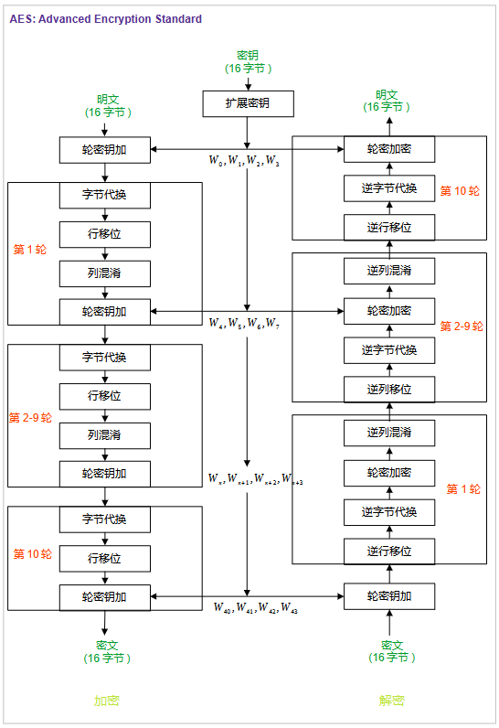
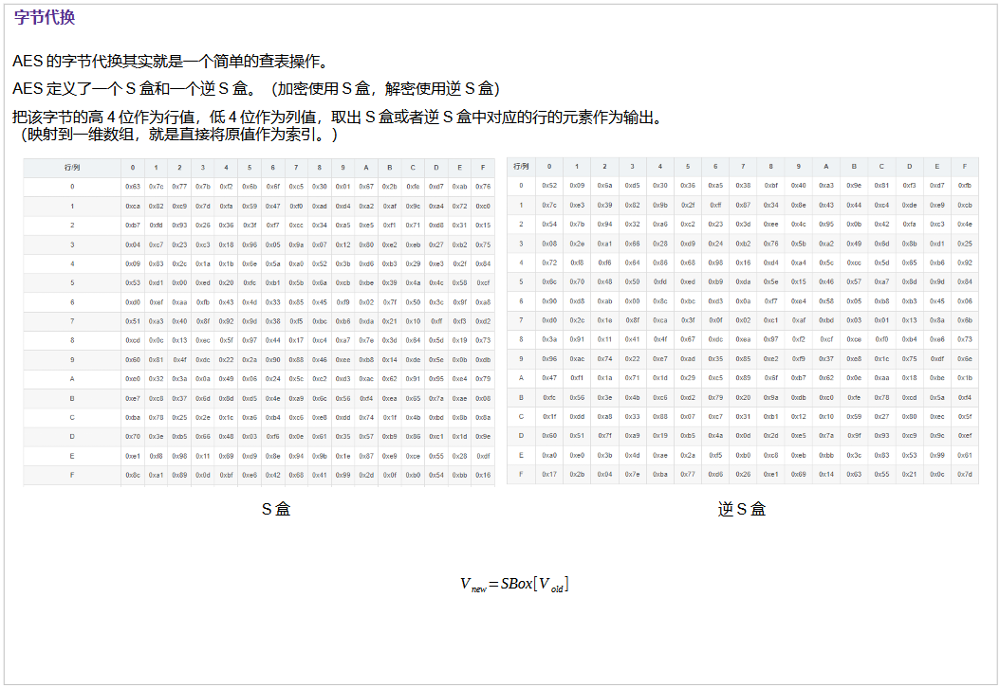
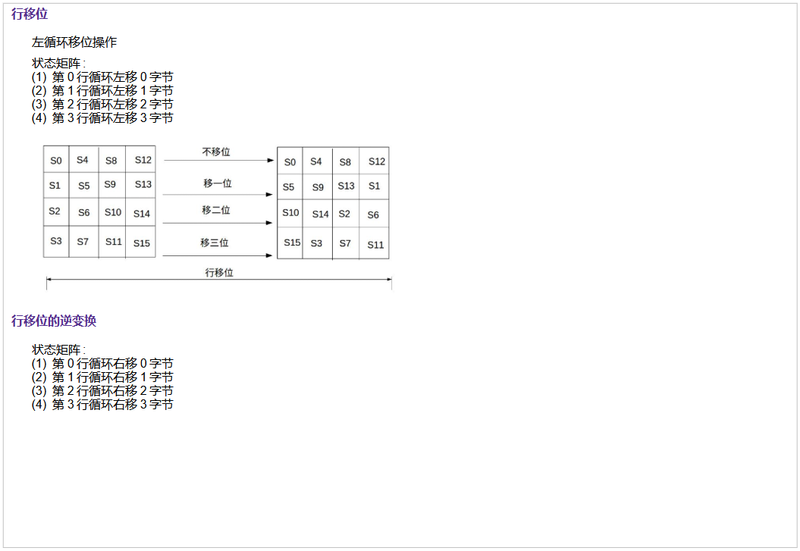

# aes

advanced encryption standard



## 一、密钥扩展


```c
// 每一轮的密钥的数据结构
typedef struct RoundKey_s {
    unsigned char roundkey_0[4];
    unsigned char roundkey_1[4];
    unsigned char roundkey_2[4];
    unsigned char roundkey_3[4];
}RoundKey_s;

// 计算每一轮的密钥，roundKeyor_last为上一轮的密钥，rounds轮数(1-10)。
RoundKey_s * KeyExpansion(RoundKey_s * roundKeyor_last,int rounds);
// 更新存储上一轮密钥的全局变量
RoundKey_s * UpdateLastRoundKey(RoundKey_s * roundKeyor);
// 将输入的128密钥，转换为RoundKey_s的结构
RoundKey_s * GetOriginRoundKey(unsigned char * key);
// 输出RoundKey_s结构的数据
void         PrintRoundKey(RoundKey_s * roundKeyor);
```

## 二、字节代换



## 三、行移位


